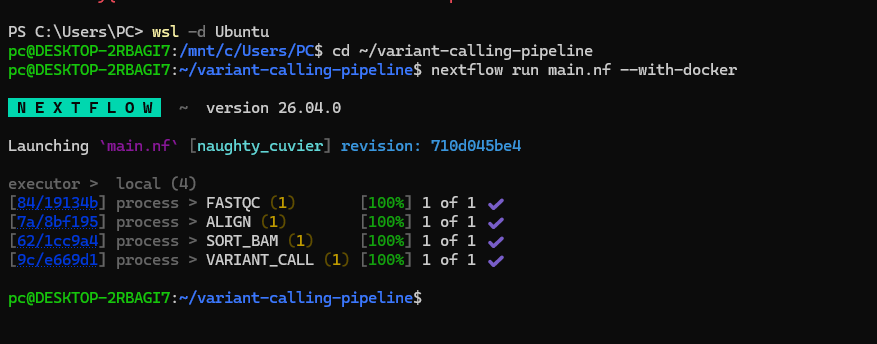

# Variant Calling Pipeline

Bioinformatics variant calling workflow built with Nextflow and Docker.

## Features

- FASTQ quality control
- FastQC analysis
- BWA sequence alignment
- SAMtools BAM sorting
- BCFtools variant calling
- Dockerized execution
- Reproducible bioinformatics workflow
- Linux/WSL2 integration

## Technologies

- Nextflow
- Docker
- FastQC
- BWA
- SAMtools
- BCFtools
- Linux
- WSL2
- Bioinformatics

## Pipeline

FASTQ → FastQC → BWA → SAMtools → BCFtools → VCF

## Run pipeline

```bash
nextflow run main.nf --with-docker
```

## Results

Pipeline successfully generates:

- FastQC reports
- aligned.sam
- sorted.bam
- variants.vcf

---
## Workflow execution


---


## Current workflow

FASTQ → FastQC → BWA → SAMtools → sorted BAM → VCF

---

## Future improvements

- Automated HTML reports
- Multi-sample processing
- Genome indexing optimization
- Cloud execution support

## Author

Agata Gabara
